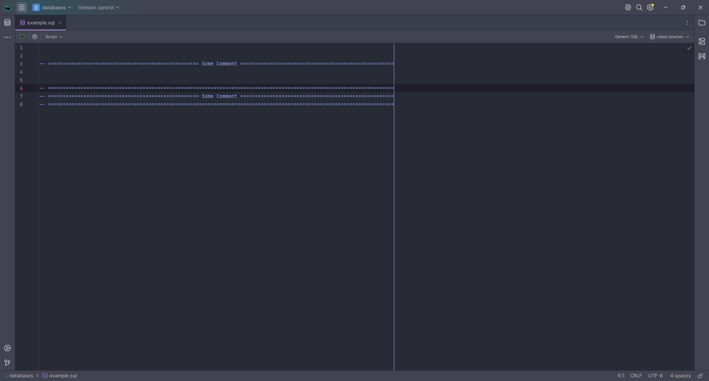

# 📝 Comment Sections – JetBrains Plugin

**Comment Sections** is a lightweight and handy plugin for JetBrains IDEs that helps you create beautiful, structured comment sections in your code. Perfect for making your code more readable and visually appealing!

## 🚀 Features

* **Single Line Comment:**
  Type `cmts <text>` or press `Ctrl + Alt + C` to create a single-line comment section.
  Example:

  ```cpp
  // ===== My Comment =====
  ```

* **Multi Line Comment:**
  Type `cmtm <text>` or press `Ctrl + Alt + N` to create a multi-line comment block.
  Example:

  ```cpp
  // =====================
  // ==== My Comment =====
  // =====================
  ```

* 🎹 **Customizable Hotkeys:**  
  You can easily change the default shortcuts to match your workflow:
    1. Go to **Settings** → **Keymap**
    2. Expand **Plugins**
    3. Select **Comment Sections** and assign your preferred shortcuts


* 🎨 **Custom Symbols:**  
  Define your own characters to decorate comment sections:
    1. Go to **Settings** → **Comment Sections**
    2. Set your preferred single-line or multi-line symbols
    3. Apply changes and enjoy your personalized comment style

## 🎗️ Example



## 🎯 Why Use It?

* Quickly add stylish, well-formatted comment sections.
* Keep your code organized and easy to read.
* Fully customizable for your personal coding style.
